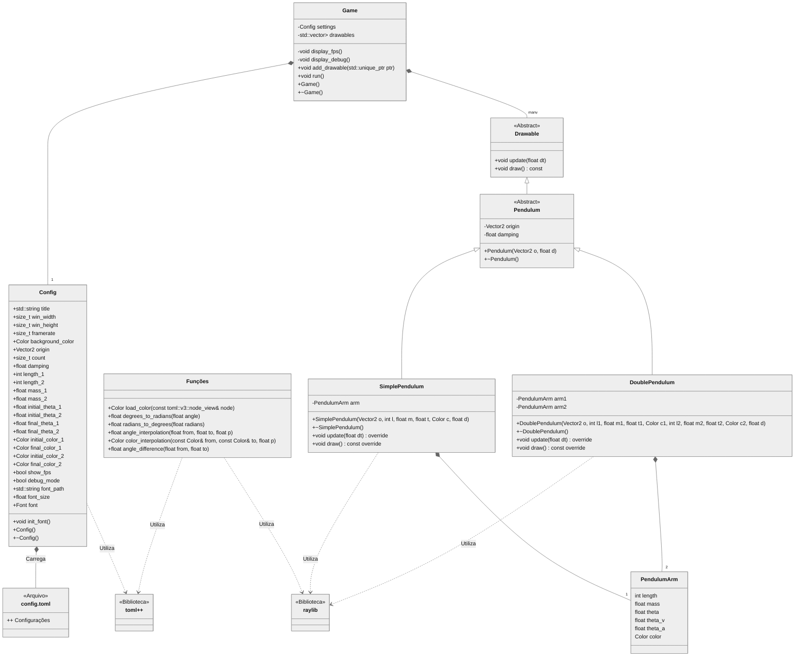

# Simulador de Pêndulos Duplos Caóticos

- `make`: compilar.
- `make run`: executar o binário principal (`/bin/pendulos`).
- `make clean`: remover arquivos-objeto e executáveis.

## Descrição

Apesar da aparente simplicidade do pêndulo duplo[^1], sua trajetória é
extremamente sensível às condições iniciais, o que o torna capaz de demonstar
comportamento caótico[^2], sendo então um excelente exemplo de um sistema
dinâmico não-linear[^3].

O movimento dos pêndulos, que foram modelados de forma orientada à objetos, é
calculado a partir de uma fórmula que considera uma constante gravitacional, o
ângulo do pêndulo em relação ao eixo Y, a aceleração e velocidade angular e
também uma constante arbitrária que simula a resistência do ar e/ou outros
fatores que afetam a perda de energia do sistema.

## Funcionalidade

- Simular milhares de pêndulos duplos com condições iniciais personalizáveis.
- Visualização gráfica do movimento dos pêndulos.
- Analisar e comparar trajetórias ao correr do tempo

## Requisitos

- C++11 ou superior
- Biblioteca [raylib](https://www.raylib.com) para visualização
- make para build

## Estrutura de arquivos

## Configurando os parâmetros da simulação

No arquivo `config.toml`:

```toml
[window]
title = "Simulação de Pêndulos"
width = 640
height = 480
framerate = 60
background = [0, 0, 0, 255]
font = "res/LiberationMono-Bold.ttf"
font_size = 18
```

- `title`: Título da janela
- `width`: Largura em pixels
- `height`: Altura em pixels
- `framerate`: Taxa de atualização
- `background`: Cor do fundo da tela
- `font`: Caminho da fonte à ser carregada
- `font_size`: Tamanho da fonte

```toml
[debug]
show_fps = true
debug_mode = false
```

- `show_fps`: Ligar ou desligar o contador de frames
- `debug_mode`: Ligar ou desligar as informações de depuração

```toml
[pendulums]
origin = [400, 400]
count = 10000
damping = 0.001
```

- `origin`: Coordenadas do ponto de origem dos pêndulos
- `count`: Número de pêndulos a serem instânciados
- `damping`: Variável que controla a diminuição da energia do sistema

```toml
[first_arm] # ou [second_arm]
length = 200
initial_theta = 180
final_theta = 180.5
initial_color = [255, 255, 255, 255]
final_color = [255, 0, 0, 255]
mass = 1
```

- `length`: Comprimento do braço do pêndulo
- `initial_theta`: Ângulo inicial dos braços
- `final_theta`: Ângulo final dos braços
- `initial_color`: Cor inicial dos braços
- `final_color`: Cor final dos braços
- `mass`: Massa do pêndulo, com o ponto gravitacional na ponta do braço.

_Nota: Os pêndulos instanciados terão seus ângulos interpolados entre o $\theta$
inicial e o $\theta$ final. \
As cores também serão interpoladas para cada braço, em proporção ao número total
de pêndulos._

## Diagrama de classes



## Continhas

Sejam $\theta_1$ e $\theta_2$ os ângulos dos pêndulos relativos ao eixo $y$,
$L_1$ e $L_2$ os comprimentos dos braços dos pêndulos e $m_1$ e $m_2$ as massas
dos pêndulos (localizadas na ponta de cada um).

$\theta_1'$ e $\theta_2'$ então são as velocidades angulares e $\theta_1'' \cdot
\Delta t$ e $\theta_2'' \cdot \Delta t$ são as acelerações dos ângulos
considerando a diferença de tempo entre cada frame.

$$
\theta_1'' = \frac {-g (2 \cdot m_1 + m_2) \sin{\theta_1} - m_2 \cdot g \cdot
\sin{(\theta_1 - 2 \cdot \theta_2)} - 2 \sin{(\theta_1 - \theta_2) \cdot m_2
\cdot (\theta_2'^2 \cdot L_2 + \theta_1'^2 \cdot L_1 \cos{(\theta_1 -
\theta_2)})}} {L1 \cdot (2 \cdot m_1 + m_2 - m_2 \cdot \cos{(2 \cdot \theta_1 -
2 \cdot \theta_2)})}
$$

$$
\theta_2'' = \frac {2 \cdot \sin{\theta_1 - \theta_2}(\theta_1'^2 \cdot L_1
(m_1 + m_2) + g \cdot (m_1 + m_2) \cdot \cos{\theta_1} + \theta_2'^2 \cdot L_2
\cdot m_2 \cdot \cos{(\theta_1 - \theta_2)})} {L2 \cdot (2 \cdot m_1 + m_2 - m_2
\cdot \cos{(2 \cdot \theta_1 - 2 \cdot \theta_2)})}
$$

Essa fórmula é derivada da equação de movimento de um pêndulo duplo. Tal equação
e o processo de derivação são melhor explicadas em artigos disponíveis na
internet.[^4][^5][^6]

## Créditos e Atribuições

- ROMULUS FONT projetada por Hewett Tsoi.
- Liberation :tm: Fonts projetadas por Red Hat.
- Contribuidores da biblioteca Raylib.

[^1]: Um pêndulo duplo consiste em dois pêndulos conectados de ponta a ponta.
[^2]:
    Pequenas diferenças nas condições iniciais produzem resultados amplamente
    divergentes para tais sistemas dinâmicos, tornando a previsão a longo prazo
    geralmente impossível.

[^3]:
    Um sistema dinâmico não-linear é caracterizado por equações que não seguem
    a superposição linear, resultando em comportamentos complexos como o caos.

[^4]: https://web.mit.edu/jorloff/www/chaosTalk/double-pendulum/double-pendulum-en.html#kinematics
[^5]: https://www.phys.lsu.edu/faculty/gonzalez/Teaching/Phys7221/DoublePendulum.pdf
[^6]: https://www.phys.lsu.edu/faculty/gonzalez/Teaching/Phys7221/DoublePendulum.pdf
